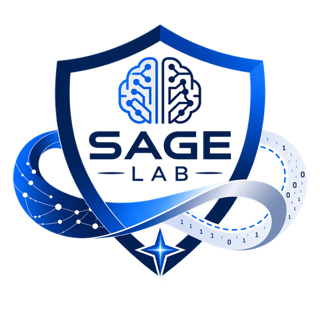

<div align="center">
  

  <h1>SAGE Lab</h1>

  <p>
    <strong>Laboratory for General Intelligence, Safety &amp; Trustworthiness</strong><br>
    上海大学通用智能与安全可信实验室
  </p>

  <p>
    <a href="https://sage-lab-shu.github.io/sage-lab/">
      
    </a>
    <a href="https://github.com/SAGE-Lab-Shu/sage-lab/actions/workflows/deploy-pages.yml">
      
    </a>
    
  </p>
</div>

> 让智能理解世界，也值得世界信任。<br>
> Intelligence that understands. Systems we can trust.

## About

SAGE Lab is the **Laboratory for General Intelligence, Safety & Trustworthiness** at the School of Computer Engineering and Science, Shanghai University.

我们研究机器如何感知、推理、行动与持续进化，也研究它们如何在真实世界中保持可靠、安全与可控。实验室教师成员包括**张新鹏、李晓强、程彭洲、杨军港、隋智美、刘洋**。

## Research

| Direction | 研究内容 |
| --- | --- |
| **Multimodal Cognition & Reasoning** | 多模态大模型、推理机制、对齐与认知建模 |
| **Autonomously Evolving Agents** | 递归自进化、在线自蒸馏、持续适应 |
| **Artificial Intelligence Security** | 智能体安全、红队测试、可信与可控 AI |
| **Multimedia Information Security** | 信息隐藏、数字取证、隐私保护 |
| **Privacy Computing & Applied Cryptography** | 差分隐私、隐私保护机器学习、区块链与应用密码学 |
| **Intelligent Distributed Systems** | 云计算智能调度、资源优化、智能计算基础设施 |
| **Computer Vision & Generative AI** | 计算机视觉、视觉语言模型、生成式人工智能 |

我们的目标是将认知与推理能力、自主智能体和系统化安全机制连接起来，探索通往**安全可信通用智能**的路径。

## Selected Work

**Latest:** Two papers from the lab have been accepted to EMNLP 2026.

- **Faithful Mobile GUI Agents with Guided Advantage Estimator** — ICML 2026 · [Paper](https://arxiv.org/abs/2605.01208) · [Code](https://github.com/Dreamer777hhw/Faithful-Agent)
- **Hidden Ghost Hand** — EMNLP Findings 2025 · [Paper](https://aclanthology.org/2025.findings-emnlp.411/) · [Code](https://github.com/CTZhou-byte/AgentGhost)
- **OS-Kairos** — ACL Findings 2025 · [Paper](https://aclanthology.org/2025.findings-acl.348/) · [Code](https://github.com/Wuzheng02/OS-Kairos)
- **GenPTW** — AAAI 2026 · [Paper](https://arxiv.org/abs/2504.19567)
- **Behavior Safety of Autonomous Interactive Agents** — Agent behavior safety survey

## Website

The homepage includes:

- Chinese and English language switching
- Faculty and student profiles
- Research directions and their relationships
- Representative work with core method figures
- Interactive demos and open-source projects
- Admissions and contact information
- Responsive layouts for desktop and mobile

Visit the live website: **[sage-lab-shu.github.io/sage-lab](https://sage-lab-shu.github.io/sage-lab/)**

## Local Development

Requirements: [Node.js](https://nodejs.org/) 20 or newer.

```bash
git clone https://github.com/SAGE-Lab-Shu/sage-lab.git
cd sage-lab
npm install
npm run dev
```

Create a production build:

```bash
npm run build
```

Preview the production build locally:

```bash
npm run preview
```

## Project Structure

```text
sage-lab/
├── assets/                    # Faculty, student, logo and research images
├── .github/workflows/         # GitHub Pages deployment
├── index.html                 # Page content and semantic structure
├── styles.css                 # Visual system and responsive layouts
├── app.js                     # Language switching and interactions
└── vite.config.js             # Vite and GitHub Pages base path
```

## Deployment

Every push to `main` triggers the GitHub Actions workflow in `.github/workflows/deploy-pages.yml`. The workflow builds the Vite project and publishes `dist/` to GitHub Pages.

## Join Us

实验室长期招收大模型、智能体与人工智能安全方向的本科生、硕士生、博士生及科研实习生。

Contact: [chengpz@shu.edu.cn](mailto:chengpz@shu.edu.cn)

---

<div align="center">
  <sub>Shanghai University · School of Computer Engineering and Science</sub>
</div>
